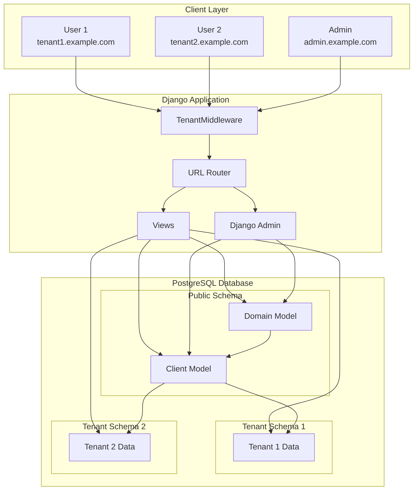
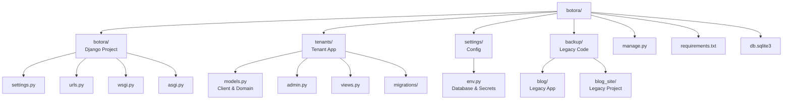
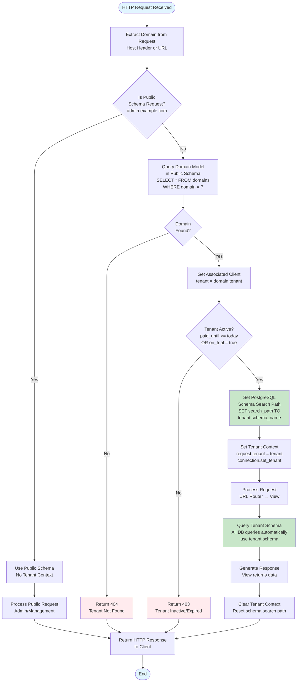
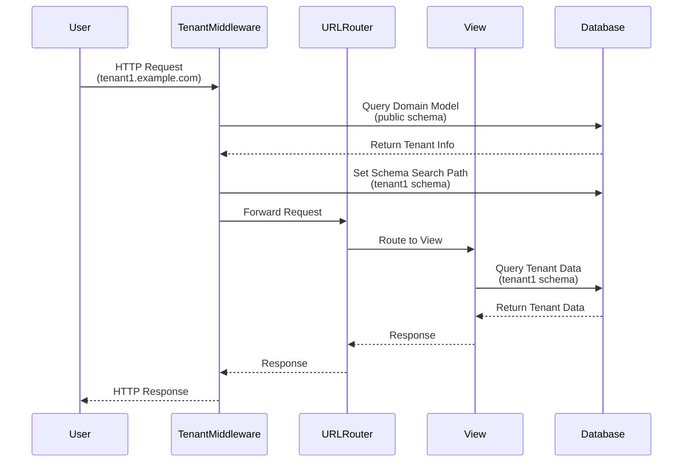

## Botora

Botora is a **multi-tenant Django 5 project** using `django-tenants`. It is structured so that each tenant has its own schema in a single PostgreSQL database, while sharing the same Django project codebase.

### Tech stack

- **Backend**: Django 5
- **Multi-tenancy**: `django-tenants`
- **API / Auth**: Django REST Framework, `djangorestframework-simplejwt`
- **Database**: PostgreSQL (via `psycopg2-binary`)

## Project Diagrams

### Architecture Overview



### Project Structure



### Database Schema Structure

```mermaid
erDiagram
    CLIENT ||--o{ DOMAIN : "has"
    CLIENT ||--|| TENANT_SCHEMA_1 : "owns"
    CLIENT ||--|| TENANT_SCHEMA_2 : "owns"
    CLIENT ||--|| TENANT_SCHEMA_N : "owns"
    
    CLIENT {
        int id PK
        string schema_name
        string name
        date paid_until
        boolean on_trial
        date created_on
    }
    
    DOMAIN {
        int id PK
        int tenant_id FK
        string domain
        boolean is_primary
    }
    
    TENANT_SCHEMA_1 {
        string "Tenant-specific tables"
        string "Isolated data"
    }
    
    TENANT_SCHEMA_2 {
        string "Tenant-specific tables"
        string "Isolated data"
    }
    
    TENANT_SCHEMA_N {
        string "Tenant-specific tables"
        string "Isolated data"
    }
```

### Workflow Algorithm



### Request Flow Sequence



### Project structure (simplified)

- **`botora/`**: Main Django project (settings, URLs, WSGI/ASGI).
- **`tenants/`**: Tenant model definitions and logic for `django-tenants`.
- **`settings/env.py`**: Environment-specific configuration (database, secret key, CORS, etc.).
- **`backup/`**: Old/sample project (`blog_site` and `blog` app) kept for reference.

### Getting started

1. **Clone the repo**

```bash
git clone https://github.com/MohamedSSalahh/trained-chat-bot.git
cd trained-chat-bot
```

2. **Create and activate a virtual environment (recommended)**

```bash
python -m venv .venv
.venv\Scripts\activate  # Windows
# source .venv/bin/activate  # Linux / macOS
```

3. **Install dependencies**

```bash
pip install -r requirements.txt
```

4. **Configure environment settings**

Edit `settings/env.py` with your real PostgreSQL settings and secret key:

- **`NAME` / `USER` / `PASSWORD` / `HOST` / `PORT`** for your database.
- **`SECRET_KEY_SETTINGS`** for Django.
- Optionally adjust `ALLOWED_HOSTS_SETTINGS` and CORS settings.

5. **Apply migrations**

```bash
python manage.py migrate_schemas
```

> If you prefer to run standard migrations during early development, you can use:
>
> ```bash
> python manage.py migrate
> ```

6. **Create a superuser**

```bash
python manage.py createsuperuser
```

7. **Run the development server**

```bash
python manage.py runserver
```

By default the project runs with `DEBUG = True` and `ALLOWED_HOSTS` taken from `settings/env.py`.

### Tenants

The project is configured to use:

- **`TENANT_MODEL = "tenants.Client"`**
- **`TENANT_DOMAIN_MODEL = "tenants.Domain"`**

Once migrations are applied, you can create tenants via the Django admin or with custom management commands (not yet included in this repository). Each tenant will use its own schema managed by `django-tenants`.

### Linting

The project includes **flake8** in `requirements.txt`. You can run it (once configured) with:

```bash
flake8
```

### Legacy / backup project

The `backup/` folder contains an older demo blog project (`blog_site` and `blog` app). It is not used by the main Botora project, but kept as reference or example code.

### Notes

- This repository currently uses a simple settings structure with `settings/env.py` checked in. In a real deployment you should move secrets (database password, secret key, etc.) into environment variables or a secrets manager.
- PostgreSQL is required because `django-tenants` relies on PostgreSQL schemas.


